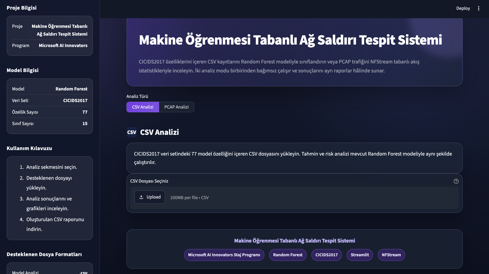
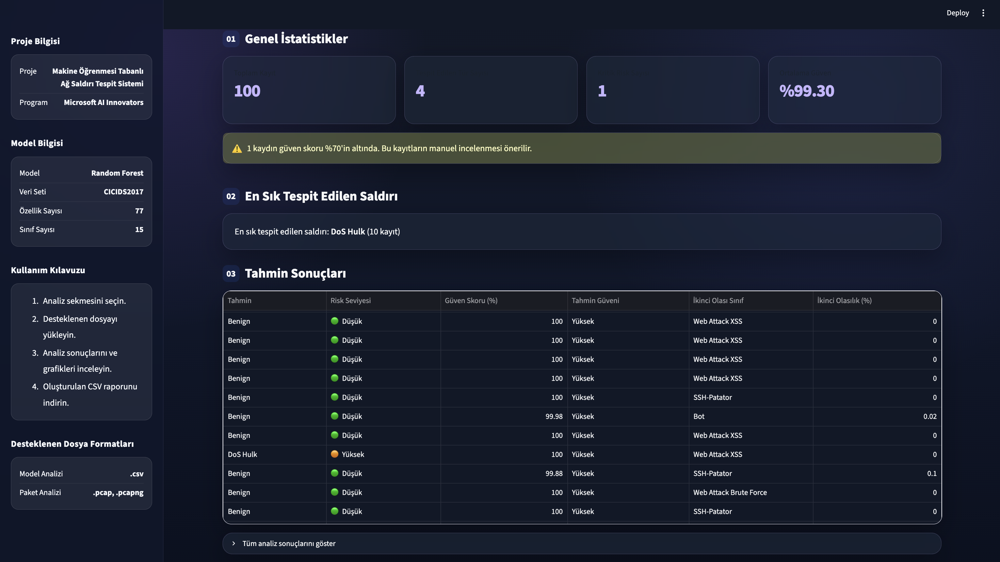
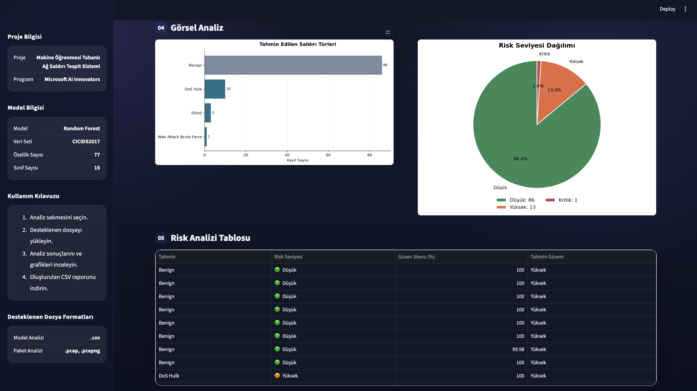
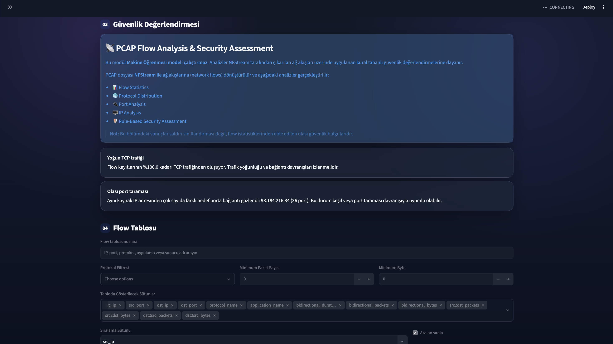

<div align="center">

# 🛡️ Network Attack Detection Dashboard

### Machine Learning & Flow-Based Network Traffic Analysis

A modern cybersecurity dashboard that combines **Machine Learning** and **Flow-Based Network Analysis** to detect suspicious network activities from CSV datasets and PCAP files.


</div>

---

# 📌 Overview

Network Attack Detection Dashboard is a cybersecurity analysis platform developed during the **Microsoft AI Innovators Internship Program**.

The application provides two independent analysis modules:

- 🤖 **CSV Analysis** using a trained Random Forest model on the CICIDS2017 dataset.
- 🌐 **PCAP Analysis** using NFStream to extract network flows and perform rule-based security assessment.

The dashboard presents attack predictions, confidence scores, visual analytics and downloadable reports through an interactive Streamlit interface.

---

# ✨ Features


```markdown
> **Note:** PCAP analysis performs rule-based traffic assessment and does not use machine learning classification.

## 🤖 Machine Learning Analysis

- Random Forest attack detection
- CICIDS2017 support
- 77 network traffic features
- 15 attack classes
- Model Probability Score
- Second Most Probable Class
- Risk Level Assessment
- Interactive charts
- CSV report export
- Missing / NaN / Infinite value validation

---

## 🌐 PCAP Flow Analysis

- NFStream flow extraction
- Protocol statistics
- Traffic visualization
- Top Talkers analysis
- Port analysis
- Rule-based security assessment
- Search & filtering
- Sortable flow table
- CSV report export

---

# 🖼️ Screenshots

## Dashboard



---

## CSV Analysis



---

## CSV Visual Analytics



---

## PCAP Flow Analysis



---

# 🛠️ Technologies

| Category | Technologies |
|----------|--------------|
| Language | Python |
| Interface | Streamlit |
| Machine Learning | Scikit-learn |
| Model | Random Forest |
| Network Analysis | NFStream |
| Data Processing | Pandas |
| Visualization | Matplotlib |

---


## 🏗️ Architecture

```text
CSV
   │
   ▼
Feature Validation
   │
   ▼
Random Forest
   │
   ▼
Risk Assessment
   │
   ▼
Dashboard


PCAP
   │
   ▼
NFStream
   │
   ▼
Flow Extraction
   │
   ▼
Rule-Based Security Assessment
   │
   ▼
Dashboard

---

## 📊 Model Performance

The Random Forest model was evaluated on a stratified test set containing **462,762 network flows**.

### Overall Performance

| Metric | Score |
|--------|------:|
| Accuracy | **99.85%** |
| Macro Precision | **92.50%** |
| Macro Recall | **83.83%** |
| Macro F1 | **86.39%** |
| Weighted F1 | **99.85%** |

### Class-wise Performance

| Attack Type | Precision | Recall | F1-Score |
|-------------|----------:|-------:|---------:|
| Benign | 99.91% | 99.96% | 99.93% |
| Bot | 83.61% | 69.10% | 75.67% |
| DDoS | 99.98% | 99.94% | 99.96% |
| DoS Hulk | 99.82% | 99.54% | 99.68% |
| DoS Slowhttptest | 94.94% | 98.76% | 96.81% |
| DoS Slowloris | 99.63% | 99.07% | 99.35% |
| FTP-Patator | 99.92% | 99.33% | 99.62% |
| PortScan | 92.39% | 90.03% | 91.19% |
| SSH-Patator | 100.00% | 97.83% | 98.90% |
| Web Attack Brute Force | 74.67% | 77.21% | 75.92% |
| Web Attack XSS | 43.01% | 30.77% | 35.87% |

> **Note:** Rare attack classes such as Heartbleed, SQL Injection and Infiltration contain very few samples. Therefore, their reported metrics may not be statistically representative.


## ⚠️ Dataset Limitations

The model was trained on the **CICIDS2017** dataset, which is highly imbalanced. While common attack categories contain tens or hundreds of thousands of samples, some attack types include only a handful of instances.

Because of this imbalance:

- Accuracy alone is not sufficient to evaluate the model.
- Macro F1 is reported alongside Accuracy and Weighted F1.
- Rare attack classes may exhibit lower recall despite the high overall accuracy.

The PCAP analysis module is **rule-based** and does **not** perform machine learning classification. It identifies suspicious network behaviors (e.g., port scanning or unusually high TCP activity) using heuristic rules extracted from NFStream flow statistics.


# 📂 Project Structure

```text
network-attack-detection-dashboard
│
├── app.py
├── csv_analyzer.py
├── pcap_analyzer.py
├── ui.py
├── helpers.py
├── constants.py
├── network_attack_detector.pkl
├── label_encoder.pkl
├── requirements.txt
├── LICENSE
└── screenshots/
    ├── dashboard.png
    ├── csv-analysis.png
    ├── csv-visualization.png
    └── pcap-analysis.png
```

---

# 🚀 Installation

```bash
git clone https://github.com/efloq/network-attack-detection-dashboard.git

cd network-attack-detection-dashboard

python -m venv venv

# macOS / Linux
source venv/bin/activate

# Windows
venv\Scripts\activate

pip install -r requirements.txt

streamlit run app.py
```

---

# 📊 Supported Files

| Analysis | Format |
|----------|--------|
| Machine Learning Analysis | `.csv` |
| Network Flow Analysis | `.pcap`, `.pcapng` |

---

# 👩‍💻 Developer

**Elifnur Sertkaya**

Microsoft AI Innovators Internship Project

---

# 🚀 Future Improvements

- Real-time packet capture
- Threat intelligence integration (AbuseIPDB / VirusTotal)
- Automated unit tests
- Model calibration
- Live monitoring support

---

# 📄 License

This project is licensed under the **MIT License**.

