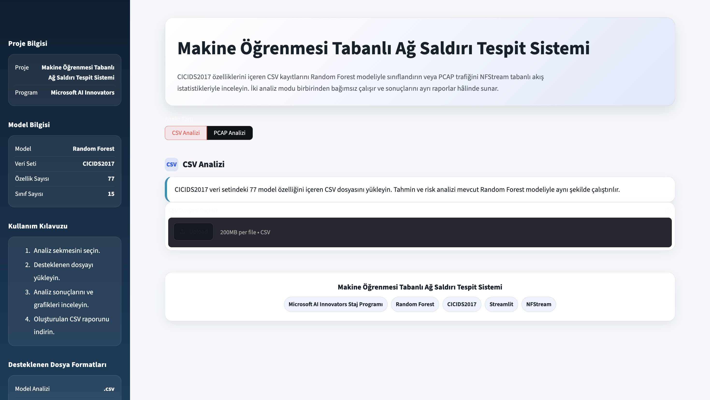
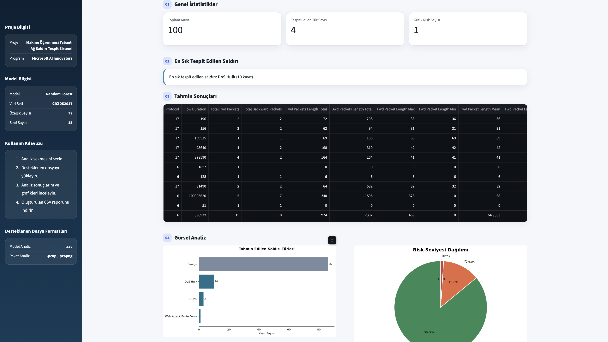
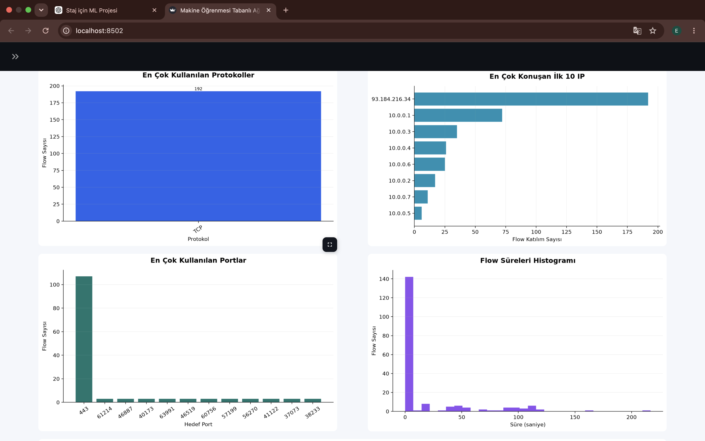
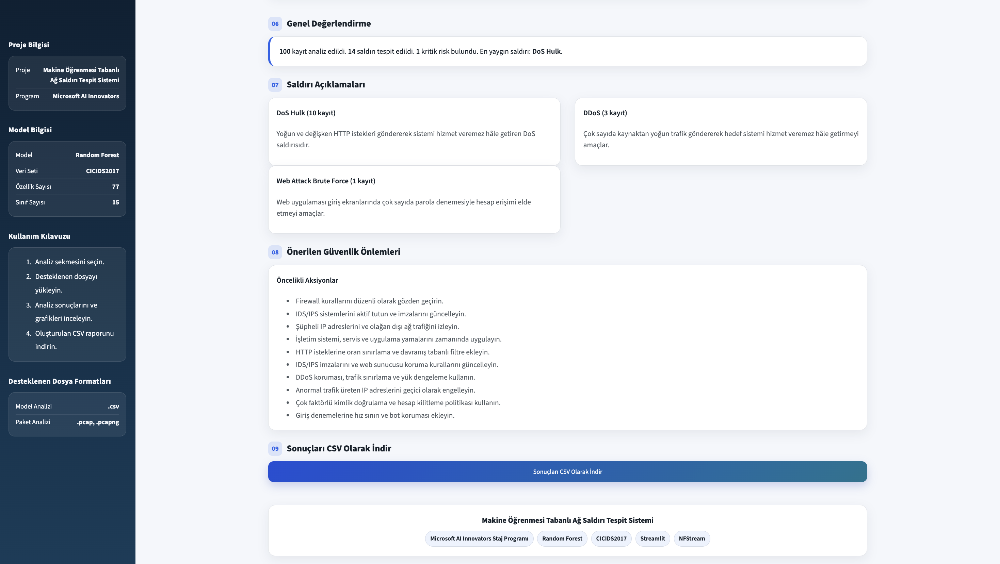

# 🛡️ Machine Learning Based Network Attack Detection Dashboard


A Streamlit-based cybersecurity dashboard that detects network attacks using Machine Learning and analyzes network traffic from PCAP files using NFStream.

<p align="center">
  
</p>

---

## 📌 Project Overview

This project was developed as part of the **Microsoft AI Innovators Internship Program**.

The application combines **Machine Learning** and **network traffic analysis** to identify malicious activities from both structured network datasets (CSV) and raw packet capture files (PCAP).

The dashboard provides an interactive interface for:

- Detecting network attacks using a trained Random Forest model
- Analyzing PCAP traffic using NFStream
- Assessing attack risk levels
- Visualizing traffic statistics
- Generating downloadable analysis reports
- Providing security recommendations

---

# ✨ Features

### 🤖 CSV Analysis

<p align="center">
  
</p>

- Upload CICIDS2017 compatible CSV files
- Automatic attack prediction
- Risk level assessment
- Interactive charts
- Attack statistics
- Security recommendations
- Export prediction results

### 🌐 PCAP Analysis

<p align="center">
  
</p>

- Upload PCAP / PCAPNG files
- Flow extraction using NFStream
- Traffic statistics
- Protocol distribution
- Top IP analysis
- Port analysis
- Flow table filtering
- Export Flow data


### 🔒 Security Assessment

<p align="center">
  
</p>

The dashboard summarizes detected attacks, explains attack types, evaluates risk levels, and provides actionable security recommendations.


---

# 🧠 Machine Learning Pipeline

The dashboard uses a **pre-trained Random Forest classifier** trained on the CICIDS2017 dataset.

Among the evaluated models (Decision Tree, Random Forest and XGBoost), the Random Forest model was selected for deployment because it provided the best balance between prediction performance, robustness, and generalization.

The Streamlit application loads the saved model (`network_attack_detector.pkl`) and performs inference on uploaded CSV files. No model training is performed during runtime.

Workflow:

```text
CICIDS2017 Dataset
        │
        ▼
Data Preprocessing
        │
        ▼
Feature Engineering
        │
        ▼
Random Forest Training
        │
        ▼
Model Evaluation
        │
        ▼
network_attack_detector.pkl
        │
        ▼
Streamlit Dashboard
        │
        ▼
Attack Prediction
        │
        ▼
Risk Assessment
```

---

# 📂 Dataset

Dataset used:

**CICIDS2017**

Dataset Statistics

| Property | Value |
|----------|-------|
| Records | 2.3 Million |
| Features | 77 |
| Attack Classes | 15 |

Example attack classes:

- Benign
- DDoS
- DoS Hulk
- PortScan
- Bot
- FTP Patator
- SSH Patator
- Web Attack
- Heartbleed

---

# 📊 Dashboard Modules

## CSV Analysis

- Upload CSV dataset
- Predict attack types
- Visualize attack distribution
- Calculate risk levels
- Generate security recommendations

## PCAP Analysis

- Upload PCAP file
- Extract network flows
- Analyze protocols
- Analyze IP addresses
- Inspect traffic statistics
- Export Flow reports

---

# 🛠 Technologies

- Python
- Streamlit
- Scikit-learn
- Random Forest
- Pandas
- NumPy
- Matplotlib
- Plotly
- NFStream
- Joblib

---

# 📁 Project Structure

```text
network_attack_dashboard/

├── app.py
├── ui.py
├── csv_analyzer.py
├── pcap_analyzer.py
├── helpers.py
├── constants.py
├── network_attack_detector.pkl
├── label_encoder.pkl
├── dataset/
├── notebooks/
├── models/
├── src/
├── images/
├── requirements.txt
└── README.md
```

---

# 🚀 Installation

Clone the repository

```bash
git clone https://github.com/efloq/network-attack-detection-dashboard.git
```

Enter the project directory

```bash
cd network-attack-detection-dashboard
```

Create a virtual environment

```bash
python3.12 -m venv venv
```

Activate it

macOS/Linux

```bash
source venv/bin/activate
```

Install dependencies

```bash
pip install -r requirements.txt
```

Run the application

```bash
streamlit run app.py
```

---


# 🚀 Future Improvements

- Real-time packet capture
- Deep Learning based attack detection
- Live alert system
- PDF report generation
- SIEM integration
- Threat Intelligence integration

---

# 👨‍💻 Developer

**Elifnur Sertkaya**

Microsoft AI Innovators Internship Project

